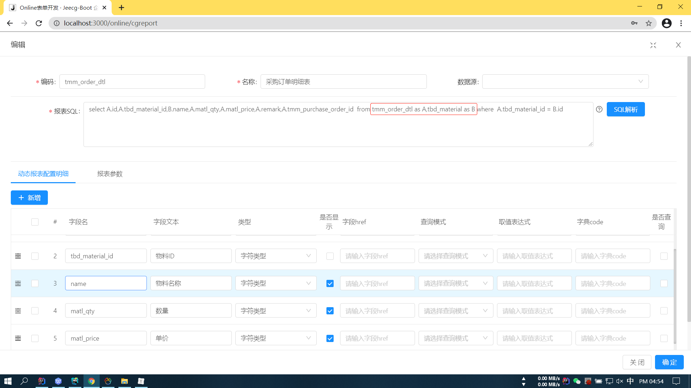
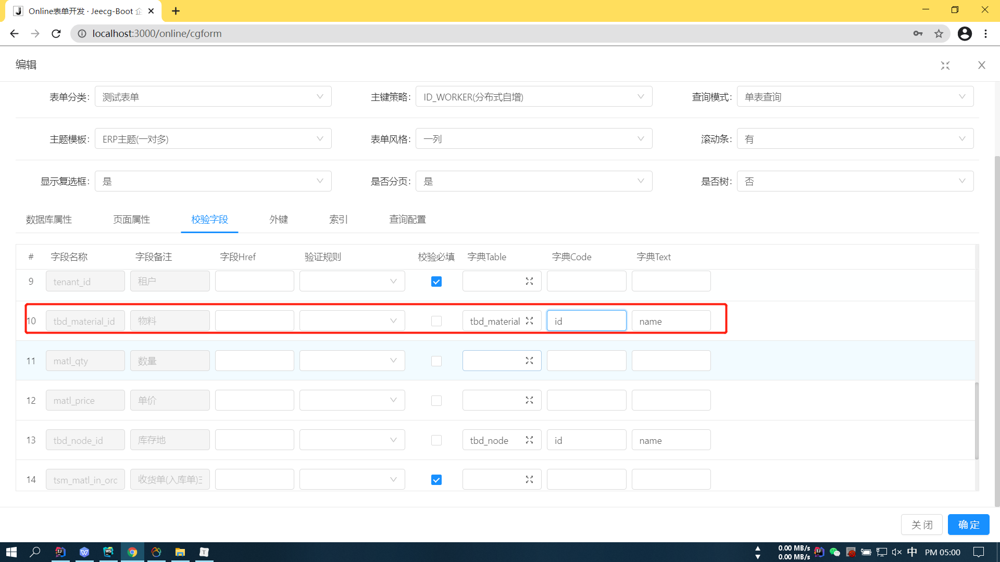

# 弹框

###### 有时候我们在弹框中获取的是id, 而我们又需要显示的是名称, 这个名称又在其他表里面

> 这时候我们可以在配置报表的时候进行联表查询操作, 通过条件把弹框所需要用到的信息查询出来:
>
> 


> ###### 选择弹框之后, 表单要显示的是名称, 而要存的是id, 却显示的是id
>
> 可以通过配置一个下拉框组件或者其他组件来关联表显示其名称:
>
> 


---


# 字典的翻译


## input页面下拉框使用[#](https://www.cnblogs.com/wjw1014/p/12242203.html#input页面下拉框使用)

**效果展示**
[](https://img-blog.csdnimg.cn/20191219154432619.png)
**实现**

1. 定义数据字典
   [](https://img-blog.csdnimg.cn/20191219154524311.png?x-oss-process=image/watermark,type_ZmFuZ3poZW5naGVpdGk,shadow_10,text_aHR0cHM6Ly9ibG9nLmNzZG4ubmV0L3dlaXhpbl80Mjc3NjExMQ==,size_16,color_FFFFFF,t_70)
2. 引用并调用JDictSelectTag组件

```javascript
import JDictSelectTag from '@/components/dict/JDictSelectTag.vue'
export default {
 	....
     components: {
       JDate,
       CustomerModal,
       JDictSelectTag
     },
     ...
}
<j-dict-select-tag :triggerChange="true" v-model="queryParam.type1Id" placeholder="请选择类型" dictCode="customer_type"/>
```

dictCode为数据字典中定义的code。

## list页面显示 数据字典[#](https://www.cnblogs.com/wjw1014/p/12242203.html#list页面显示-数据字典)

**效果展示**
处理前
[](https://img-blog.csdnimg.cn/20191219154729217.png)
处理后
[](https://img-blog.csdnimg.cn/20191219154748123.png)
**实现**

1. 实体类添加注解

```java
@Dict(dicCode = "customer_type")
private String type1Id;
```

dicCode为数据字典中定义的code。
\2. 修改table column定义

```javascript
{
  title:'类型',
   align:"center",
   dataIndex: 'type1Id_dictText',
 },
```

dataIndex值为字段名+"_dictText"
修改后也可以在vue中查看数据源。
[](https://img-blog.csdnimg.cn/20191219154956775.png?x-oss-process=image/watermark,type_ZmFuZ3poZW5naGVpdGk,shadow_10,text_aHR0cHM6Ly9ibG9nLmNzZG4ubmV0L3dlaXhpbl80Mjc3NjExMQ==,size_16,color_FFFFFF,t_70)

## list页面显示 表关联[#](https://www.cnblogs.com/wjw1014/p/12242203.html#list页面显示-表关联)

**效果展示**
处理前
[](https://img-blog.csdnimg.cn/20191219155038727.png?x-oss-process=image/watermark,type_ZmFuZ3poZW5naGVpdGk,shadow_10,text_aHR0cHM6Ly9ibG9nLmNzZG4ubmV0L3dlaXhpbl80Mjc3NjExMQ==,size_16,color_FFFFFF,t_70)
处理后
[](https://img-blog.csdnimg.cn/2019121915505565.png?x-oss-process=image/watermark,type_ZmFuZ3poZW5naGVpdGk,shadow_10,text_aHR0cHM6Ly9ibG9nLmNzZG4ubmV0L3dlaXhpbl80Mjc3NjExMQ==,size_16,color_FFFFFF,t_70)
**实现**

1. 实体类添加注解

```java
@Dict(dicCode = "id",dictTable = "sys_user",dicText = "realname")
private String managerId;
dicCode为关联表的组件
dictTable为关联表
dicText 为需要显示的内容
```

1. 修改table column定义

```javascript
{
  title:'负责人',
   align:"center",
   dataIndex: 'managerId_dictText'
 },
```

dataIndex值为字段名+"_dictText",和数据字典的一致。

---


# 请求相关

在发请求的时候, 如果是集合, 切记==不可以用接口类型来接收==, 否则会报错(没有对应的Init方法)

如果是post请求, 则一定要使用@RequestBody来接收, 否则默认当作请求参数(@params)

==**复杂数据类型放在请求体中**==

requestBody尽量保持一个, 不然会出现莫名奇妙的问题

---


==**batch复用: 前端可以传递一个字符串(122,1345)或者(122,1345,), 后端用一个List<String>集合来接收,:**==

==**后端的接收规则是: 按照 , 来拆分来存储到List中.   (122,1345)的size为2, (122,1345,)的size为3**==

后端也可以用Stirng类型来接收, 只是要自己手动split, 而直接用List接收的效果就是split(",")

---


# 后台对象属性的拷贝

==支持复杂数据类型的拷贝:==

```java
BeanUtils.copyProperties(matlInOrderPage, matlInOrder);
```


@transitional注解: 不会马上操作数据库, 而是直接结果没有异常然后再一次性操作数据库, **==所以在@transitional的方法里面不能马上直接看到数据库数据的变化==**, 所以, 如果是先根据查询到的结果再改变数据库的数据的话, 不要在此方法上标注此注解


前端传过来的记录有id, 但是子记录的外键没有存主记录的主键


# 内嵌表生成的弹框失效

==**将destFields属性改成控件对用的key就行了, orgFields是弹框查询出来的字段:**==

```json
{
  title: '库存地',
  key: 'tbdNodeId',
  type: FormTypes.select,
  dictCode:"tbd_node,name,id",
  width:"200px",
  placeholder: '请输入${title}',
  defaultValue: '',
 },
{
  title: '凭证单号（采购订单明细表ID）',
  key: 'voucherId',
  type: FormTypes.popup,
  popupCode:"tmm_order_dtl",
  destFields:"voucherId,tbdNodeId",
  orgFields:"id,tbd_material_id",
  width:"200px",
  placeholder: '请输入${title}',
  defaultValue: '',
},
```


# popup弹框

==**生成代码之后要修改弹框的内容, 直接修改在线表单的报表配置就行了, 生成的代码也是生效的**==


# 多租户情况

==**开启了多租户, 如果自己写sql, 如果是insert就不用加上租户id, 系统会自动加上租户id, 这个水有点深, 如果是选出来的东西再insert去其他表, 那么选出来的东西就必须把tenant_id一起选出来**==


# j-date的初始值

接收的是一个 字符串的值, 我们直接拿变量的值是拿不到的, 可以直接调用一个函数, 函数返回当前时间的字符串

```vue
 postingDateRules: {
          rules: [{ required: true, message: '请选择过账日期!' }],
          initialValue: this.getDate()
        }
        
        
  getDate() {
      let date = new Date()
      return date.getFullYear() + '-' + (date.getMonth() + 1) + '-' + date.getDate()
    },
 
```


# online在线表单的配置

==**在新建在线表单的时候, 如果选了表类型为附表的话, 则页面属性的控件类型是比主表少很多的, 当我们的表是附表时, 可以先把表类型选成主表, 选择完成控件之后再选择表类型**==