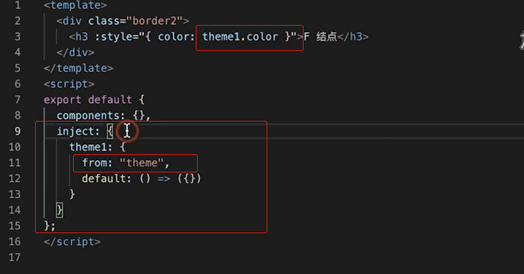

# npm的几种安装方式的区别

**npm install X:**

- 会把X包安装到node_modules目录中
- 不会修改package.json
- 之后运行npm install命令时，不会自动安装X

==**m install X –save:**==

- 会把X包安装到node_modules目录中
- 会在package.json的dependencies属性下添加X
- 之后运行npm install命令时，会自动安装X到node_modules目录中
- 之后运行npm install
  –production或者注明NODE_ENV变量值为production时，会自动安装msbuild到node_modules目录中

**npm install X –save-dev:**

- 会把X包安装到node_modules目录中
- 会在package.json的devDependencies属性下添加X
- 之后运行npm install命令时，会自动安装X到node_modules目录中
- 之后运行npm install
  –production或者注明NODE_ENV变量值为production时，不会自动安装X到node_modules目录中

**使用原则:**

运行时需要用到的包使用–save，否则使用–save-dev。


# 事件的触发

## 1. change事件


change事件会根据Input输入框的变化实时性来触发改事件


# 插槽

### slot的新语法和旧语法:


---

==v-slot:名字               		v-slot:名字='接收属性' 			slot-scope='接收属性'   	接收属性可以接收使用组件的时候传递过来的值==


# 双向绑定

vue是单向数据流, 不是双向绑定, vue的双向绑定只不过是语法糖而已, v-model实际上是v-bind和@input的简写形式:

下面的组件都实现了双向数据绑定, 但是底层更趋向于第二种, 即==属性传递和事件监听的组合方式==:


##### 例子:

==1. input框中的vue通过拿vue实例中的value属性的值得到==

==2. 改变vue实例中的值: 当input框发生改变的时候, 拿到input框中的值, 然后赋值给vue中的value变量==

```javascript
<!DOCTYPE html>
<html lang="en">
<head>
    <meta charset="UTF-8">
    <title>test</title>
    <script src="../js/vue.js"></script>
</head>
<body>
<div id="app">
    <input v-model="value">
        //1. input框中的vue通过拿vue实例中的value属性的值得到
        //2. 改变vue实例中的值: 当input框发生改变的时候, 拿到input框中的值, 然后赋值给vue中的value变量
    <input type="text" :value="value" @input="value=$event.target.value">
    {{value}}
</div>
<script>
    new Vue({
        el: '#app',
        data: {
            value: ''
        }
    })
</script>
</body>
</html>

```

##### model属性实现自定义组件的双向数据绑定

```javascript
<!DOCTYPE html>
<html lang="en">
<head>
    <meta charset="UTF-8">
    <title>test</title>
    <script src="../js/vue.js"></script>
</head>
<body>

<div id="input-test-demo">
    <span style="color: red">{{value}}</span>
    <input-test v-model="value"></input-test>
</div>

<script>
    Vue.component('input-test',{
        model:{
            prop:'value',
            event: 'input-event'
        },
        template:`<input type="text" v-bind:value="value" v-on:input="$emit('input-event', $event.target.value+'<<<====')"/>`
    })

    new Vue({
        el:'#input-test-demo',
        data:{
            value: '请输入'
        }
    })


</script>
</body>
</html>

```


==**v-model中默认的绑定的属性和事件:**==   **例如: 在text文本框中, v-model='xxx'   这就相当于value='xxx'    可以利用model属性来修改绑定的默认属性和事件**


###### 自定义一个组件, 并且用model指明绑定的默认属性和事件:


# data属性

==因为组件是复用的, 所以还没有实例化的组件必须使用函数的形式来返回组件中的数据, 以确保数据的独立性; 已经实例化的组件则使用属性的形式来声明data==

## 如何自定义一个组件?

使用vue指令绑定的值必须是接收属性, 也就是使用的时候接收过来的


​					==使用:==


---

###### 使用组件时传递了一个没有声明的属性:

**假如我们传递了一个我们没有声明的属性, 则默认挂载到组件的根据点:**


---

# 插槽

**插槽可以传递一个模板, 这一点是传递属性所做不到的**

2.5语法:


**2.6新语法: 需要一个template标签**


## **作用域插槽:**

定义插槽的时候可能会传递一些值, 在我们使用的使用就可以通过使用==**v-slot:slotName='{传递过来的属性}'**==获取传递过来的值, 然后就可以使用了:


==**假如定义的插槽没有被插入, 则默认里面的子组件会生效, 否则插槽里面的子组件会被覆盖掉**==

# 


## 关于插槽的几点事件:

在定义插槽的时候可以使用slot或者template, 在定义的时候可以指定一个接收属性,  在我们使用的时候就可以使用slot-scop来进行传值:


执行结果:


---


## 相同的插槽是合并还是替换?


# 响应式更新

> **vue做响应式更新dom元素的条件(必须是被vue监视管理的属性)**

1. ==模板必须是要使用到这个属性或者对象==

2. ==属性必须是放在data函数中作为return 返回==

   

   

   

   ---

   # 计算属性

   #### ==**计算属性里面用到的属性必须是响应式的数据类型**==,不然依赖数据变化时, 不会重新计算该属性, 因为该数据没有被监听


# 监听器: watch

这里我们对e进行了深度监听, 所以当e或e的子元素发生改变时也能触发该函数的执行:


---


# 组件的生命周期

创建和销毁阶段只会执行一次, ==更新阶段会执行多次==


 

---


# vue的内置指令

**v-cloak在html中用到, 在.vue中很少用到, 作用就是防止元素还没挂在渲染在dom节点时**


## 自定义指令的生命周期


## 自定义指令

vue使用directive来自定义指令:  

==生命周期的回调函数会传入两个值, 一个是el, 表示使用这个指令的标签元素, 另一个是biding绑定规则, 是一个对象, 可以在这个对象中获取到我们所需要用到的值==

通过销毁按钮来销毁vue指令:(**当指令所在的标签被干掉之后指令自然被销毁**)


 

# 组件的通信

## provide和inject

使用场景: ==**组件之间必须有层级关系**==(当这个组件引入并使用了其他组件, 这两个组件自然就有层级关系了)


一下结构跟上面的层级关系是一致的:

==A组件==: A组件的下一层级时B,C,D组件, 并且A组件提供了theme属性(为了保证数据的独立性, ==**provide使用函数的形式进行返回**==)


==E组件==: 通过inject来注入(向上寻找)属性 , 在h3标签中就可以使用这个属性了


==F组件==: 如果要接收的属性和本组件中的名字冲突的时候, 还可以使用别名的方式来进行替代, 用from指定要接收的属性




==C组件==: 加入我们在C组件同样提供了一样的属性, 则下层组件就不会找到A组件去拿到对应的属性, 而是在C组件中拿到对应的属性, 这点有点像**冒泡机制**, inject注入属性的时候从下网上找, 直到找到为止


==**注意点:**==我们要使父组件的对应属性的更新能重新传递给子组件的话, 必须提供响应式的数据, 而不能时字符串常量, 可以直接传递this过去, 不过这样做会传递了冗余的属性, 在a组件中可以这样子传递以达到父子联动的效果


**可以通过vue的api Vue.observable来优化响应式provide:**


## props接收属性时进行校验


# ref引用信息

**==如果是普通节点, 获取到的是dom元素, 如果是自定义组件, 获取到的是组件的实例==**


# template和jsx

这两个只是一个语法糖而已, 最终都会被编译成createElement('标签', '标签内的文本')


# 支持响应式更新的方法


#  vuex状态管理

1. 安装: cnpm install vuex --save

2. 引入和全局使用: 

   ```javascript
   import Vuex from 'vuex'
   //为vue全局注入了$store属性, 后面就可以通过this.$store来获取这个Store对象
   Vue.use(Vuex)
   
   const store = new Vuex.Store({....})
   //在main.js中注册store就可以全局使用了, vue实例就可以通过this.$store来获取store, 组件可以直接通过$store来获取store实例
   new Vue({
     store,
     el: '#app',
     components: {App},
     template: '<App/>'
   })
   
   ```

3. 具体配置:

   ```javascript
   const store = new Vuex.Store({
     state: {
       count: 0
     },
     mutations: {
       //第一个参数a为回调参数, 是vuex的状态state, 第二个参数可以是组件传递过来的参数
       increment(a) {
         a.count++
       }
     },
     //因为vuex都是响应式的数据, 所以也有getters属性, 它的回调参数是一个state对象, 旨在任何一个数据变化是, 都能在getter获取到对象的状态
     getters: {
       doubleCount(sate) {
         return sate.count * 2
       }
     },
   
   
     actions: {
       /**
        * @param object {
        commit: ƒ boundCommit(type, payload, options)
        dispatch: ƒ boundDispatch(type, payload)
        getters: {}
        rootGetters: {}
        rootState: {__ob__: Observer}
        state: {__ob__: Observer}
        __proto__: Object}
        由此可见, 回调参数为一个object对象, 所以我们只需要用解构的方式来获取我们所需要的数据而不用全部获取
        */
       increment({state}) {
         setTimeout(() => {
           state.count++
         }, 3000)
   
       }
     }
   })
   ```

4. 使用: ==**所需要的响应式数据只需要放在计算属性中返回即可**==

   ```javascript
   //所需要的响应式数据只需要放在计算属性中返回即可
   export default {
       name: 'App',
       computed:{
         count(){
           return this.$store.state.count
         }
       }
     }
   ```

5. 具体调用和更改响应式数据:

   ```javascript
   <template>
     <div id="app">
       {{count}}
       <br>
       {{$store.getters.doubleCount}}
       //我们commit到mutation时还可以传递自己的参数给mutation处理, mutation函数用第二个参数接收, 第一个参数固定为state对象回传, 本例不再演示
       <button @click="$store.commit('increment')">count++</button>
       <button @click="$store.dispatch('increment')">count++</button>
     </div>
   </template>
   ```

   


**vuex的运行机制:** action一般是用与做异步  的, 例如发ajax请求等等


## vuex的核心概念

state提供响应式数据,		getter提供获取响应式的值,		mutation触发state的改变,		action通过驱动mutation来改变state的状态

第一次提交


第二次提交


第三次提交